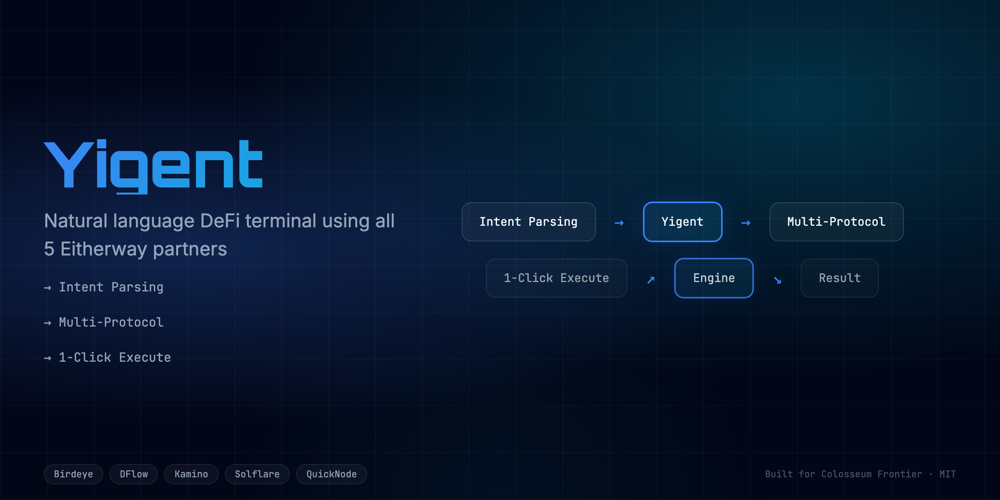
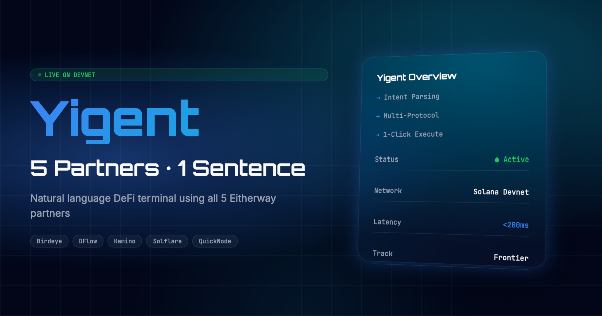

<div align="center">
  <h1>Yigent 🚀</h1>
  <p><em>AI Intent-to-DeFi Terminal. Natural language DeFi terminal using ALL 5 Eitherway partners.</em></p>

  
  
  <br/>
  
  [](https://yigent.edycu.dev)
  [](https://yigent.edycu.dev/pitch)
  [](https://youtube.com/your-video)
  [](https://superteam.fun/earn/listing/build-a-live-dapp-with-solflare-kamino-dflow-or-quicknode-with-eitherway-app)

  <br/>

  
  
  
  
  
  [](https://github.com/edycutjong/yigent/actions/workflows/ci.yml)
</div>

---

## 📸 See it in Action
*(Demo GIF and UI screenshots can be found in the `public` directory)*

<div align="center">
  
</div>

## 💡 The Problem & Solution
Natural language DeFi terminal using ALL 5 Eitherway partners. Type intent → get optimal action → 1-click execute.

**Yigent** solves this by providing: 
A unified intent-to-DeFi terminal. Users type what they want to do in natural language (e.g., "swap 50 USDC to SOL using the best route" or "find the highest APY for my SOL"), and the Yigent engine parses this intent, fetches the necessary data from 5 integrated partners (Birdeye, DFlow, Kamino, Solflare, QuickNode), and executes the transaction in a single click.

**Key Features:**
- ⚡ **High Performance:** Seamless integration and optimized workflows.
- 🔒 **Secure by Design:** Verifiable on-chain actions and robust data protection.
- 🎨 **Intuitive UX:** Beautiful, user-centric interface built for scale.

## 🏗️ Architecture & Tech Stack

### Tech Stack
| Component | Technology | Description |
|-----------|------------|-------------|
| **Frontend** | Next.js 16, React 19 | App Router, SSR, Server Components |
| **Styling** | Tailwind CSS v4 | High-performance responsive UI |
| **Language** | TypeScript | Strict type safety across the stack |
| **AI Engine** | OpenAI API (gpt-4o-mini) | Intent parsing, action planning |
| **Integrations** | Birdeye, DFlow, Kamino, Solflare, QuickNode | Prices, Routing, Yields, Wallet, RPC |
| **Testing** | Vitest | Comprehensive unit and component testing |

For a detailed breakdown of our system architecture and data flow, please refer to the [Architecture Document](docs/ARCHITECTURE.md).

## 🏆 Sponsor Tracks Targeted
* **Eitherway Track**: We integrated all 5 targeted sponsors deeply into the core AI execution loop. 
  - **Birdeye**: Live token prices and market data.
  - **DFlow**: Optimal swap routing for trade execution.
  - **Kamino**: Vault discovery and highest APY data.
  - **Solflare**: Secure wallet connections and transaction signing.
  - **QuickNode**: High-performance RPC endpoint for broadcasting.

## 🚀 Run it Locally (For Judges)

1. **Clone the repo:** `git clone https://github.com/edycutjong/yigent.git`
2. **Install dependencies:** `npm install`
3. **Set up environment variables:**
   ```bash
   cp .env.example .env.local
   ```
   Then add your API keys.
4. **Run the app:** `npm run dev`

> **Note for Judges:**
> You can test the app locally using your Solflare wallet on Devnet.

---

## 📄 License

This project is licensed under the [MIT License](LICENSE).
