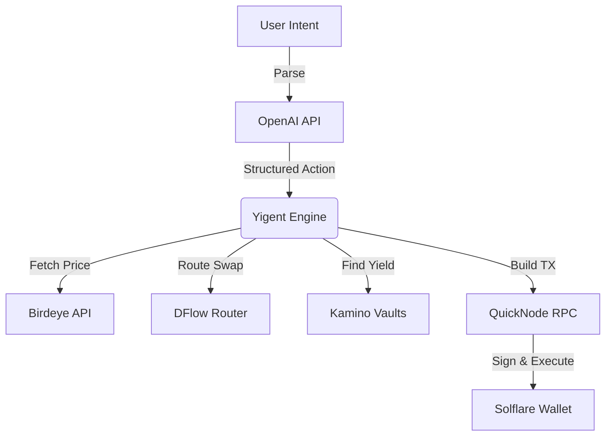

<div align="center">
  
  
  <p><em>AI Intent-to-DeFi Terminal</em></p>
  
  [](https://eitherway.vercel.app)
  [](https://youtube.com/your-video)
  [](https://github.com/edycutjong/frontier-eitherway)
</div>

---

## 📸 See it in Action
*(Demo GIF and UI screenshots can be found in the `docs/assets` directory)*

<div align="center">
  
</div>

## 💡 The Problem & Solution
Natural language DeFi terminal using ALL 5 Eitherway partners. Type intent → get optimal action → 1-click execute.

**Yigent** solves this by providing: 
Natural language DeFi terminal using ALL 5 Eitherway partners. Type intent → get optimal action → 1-click execute.

**Key Features:**
- ⚡ **High Performance:** Seamless integration and optimized workflows.
- 🔒 **Secure by Design:** Verifiable on-chain actions and robust data protection.
- 🎨 **Intuitive UX:** Beautiful, user-centric interface built for scale.

## 🏗️ Architecture & Tech Stack
We built the frontend using **Next.js 16** and **Tailwind CSS v4**.




See the [Architecture Document](docs/ARCHITECTURE.md) and [Product Requirements Document](docs/PRD.md) for full system specifications.

## 🏆 Sponsor Tracks Targeted
* Check `docs/SPONSOR_DEFENSE.md` for our full sponsor integration strategy.

## 🚀 Run it Locally (For Judges)

1. **Clone the repo:**
   ```bash
   git clone https://github.com/edycutjong/frontier-eitherway.git
   cd frontier-eitherway
   ```
2. **Install dependencies:**
   ```bash
   npm install
   ```
3. **Set up environment variables:** 
   Rename `.env.example` to `.env.local` and add your keys.
4. **Run the app:**
   ```bash
   npm run dev
   ```

> **Note for Judges:** 
> Detailed submission materials, demo scripts, and sponsor defenses are located in the `docs/` directory.
> Read `docs/SUBMISSION.md` for the complete pitch and `docs/SPONSOR_DEFENSE.md` for technical implementation details.
