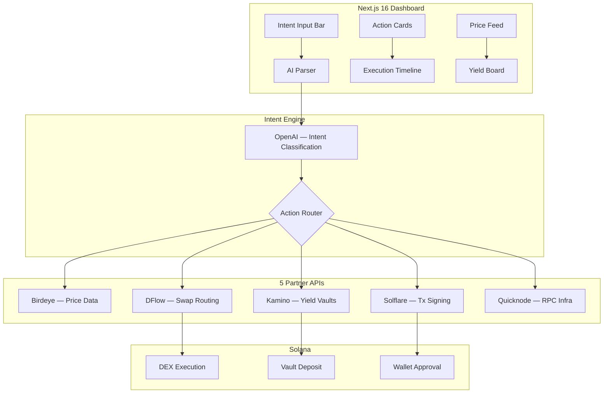

# Yigent — Technical Architecture

## System Architecture



## Tech Stack

| Layer | Technology | Why |
|---|---|---|
| **Frontend** | Next.js 16 (App Router), React 19 | Standard |
| **Styling** | Tailwind CSS v4 | Terminal aesthetic |
| **AI** | OpenAI API (gpt-4o-mini) | Intent parsing, action planning |
| **Prices** | Birdeye API | Live token prices, market data |
| **Swaps** | DFlow SDK | Optimal swap routing |
| **Yields** | Kamino API | Vault discovery, APY data |
| **Wallet** | Solflare Wallet Adapter | Transaction signing |
| **RPC** | Quicknode | High-performance Solana RPC |
| **Database** | Supabase | Intent logs, cached responses |

## Partner Integration Map

| Partner | Feature Used | Depth | Remove = ? |
|---|---|---|---|
| **Birdeye** | Token prices, market data, trending | 🟢 Deep | No price context |
| **DFlow** | Swap routing, quote comparison, execution | 🟢 Deep | No swap capability |
| **Kamino** | Vault list, APY data, deposit instructions | 🟢 Deep | No yield actions |
| **Solflare** | Wallet connection, tx signing, balance | 🟢 Deep | No user wallet |
| **Quicknode** | Solana RPC, WebSocket, tx confirmation | 🟢 Deep | No blockchain access |

## API Routes

| Method | Path | Description | Partner |
|---|---|---|---|
| POST | `/api/intent` | Parse natural language → structured action | OpenAI |
| GET | `/api/prices/:token` | Fetch live token price | Birdeye |
| POST | `/api/swap/quote` | Get optimal swap route | DFlow |
| GET | `/api/yields` | List available yield vaults + APY | Kamino |
| POST | `/api/execute` | Build + submit transaction | Solflare + Quicknode |
| GET | `/api/history` | User's intent + execution history | Supabase |

## Database Schema

```sql
CREATE TABLE intents (
    id UUID PRIMARY KEY DEFAULT gen_random_uuid(),
    wallet_address TEXT NOT NULL,
    raw_text TEXT NOT NULL,
    parsed_action JSONB NOT NULL,
    partners_used TEXT[] NOT NULL,
    execution_status TEXT DEFAULT 'pending',
    tx_signature TEXT,
    created_at TIMESTAMPTZ DEFAULT NOW()
);

CREATE TABLE cached_prices (
    token TEXT PRIMARY KEY,
    price_usd NUMERIC NOT NULL,
    source TEXT DEFAULT 'birdeye',
    updated_at TIMESTAMPTZ DEFAULT NOW()
);
```

## Intent Classification Schema

```json
{
    "intent": "swap" | "yield" | "price_check" | "portfolio",
    "input_token": "USDC",
    "output_token": "SOL",
    "amount": 50,
    "constraint": "safest" | "highest_apy" | "lowest_fee",
    "partners_required": ["birdeye", "dflow", "kamino", "solflare", "quicknode"]
}
```
